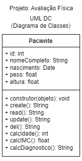
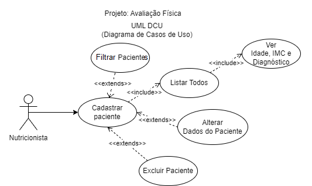
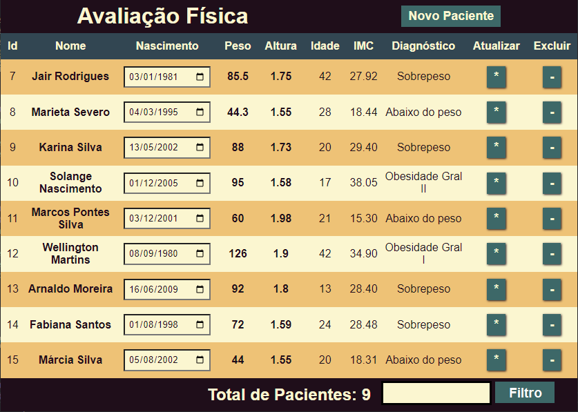
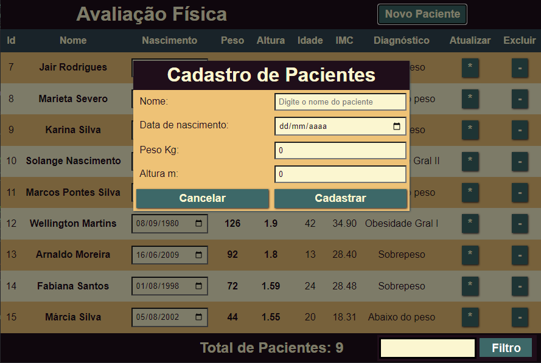
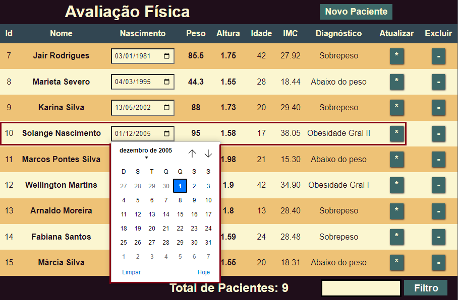
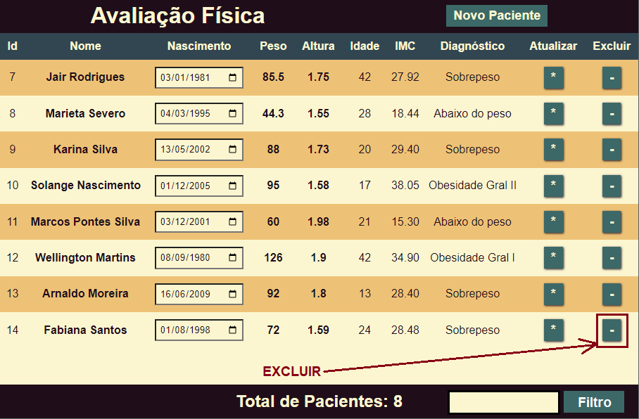

# Atividades de Produtividade FullStack (ejs/pug)

## Tema 1 - Avaliação Física

|Contextualização:|
|-|
|A Sra. Carla Prestes é nutricionista e precisa de um sistema para cadastrar seus pacientes e que faça um rápido pré-diagnóstico|

- O Analista de sistemas já realizou a **análise de requisitos** e documentou conforme diagramas a seguir:

|Documento|Diagrama|
|-|-|
|DER Modelo Conceitual||
|UML - DC||
|UML - DCU||

|Desafio-1:|
|-|
|Você foi contratado como Programador Full-Stack, por isso deve desenvolver o Back-end e a Aplicação Web com as funcionalidades documentadas, utilize os dados abaixo para testar sua aplicação e desenvolva o Front-End integrado conforme WireFrames a seguir, crie um diagrama de Atividades com o intúito de treinar a usuária nas funcionalidades da aplicação|

|Nome|Nascimento|Peso|Altura|
|-|-|-|-|
|Jair Rodrigues|1981-01-03|85.5|1.75|
|Marieta Severo|1995-03-04|44.3|1.55|
|Karina Silva|2002-05-13|88|1,73|
|Solange Nascimento|2005-12-01|95|1.58|
|Marcos Pontes|2001-12-03|60|1.98|

### WireFrame

|Descrição|Tela|
|-|-|
|Tela CRUD||
|Modal de Cadastro||
|Alteração via linhas editávejs da tabela||
|Botão para excluir||

|Observações:|
|-|
|Dados calculados nem sempre precisam ser armazenados em bancos de dados: - Podem ser calculados através de **visões**(Views) no SGBD e apenas exibidos os resultados, - Podem ser calculados na API back-end através de métodos/funções: &emsp;- Podem ser calculados quando os dados são listados um a um &emsp;- Podem ser calculados quando os dados são todos de uma vez &emsp;- Podem ser calculados quando os dados são cadastrados e armazenados no banco de dados - Para cada problema devemos avaliar qual a melhor alternativa quanto a processamento e armazenamento **- Neste caso o Analista decidiu que os resultados dos cálculos não devem ser armazenados então calcule nos métodos da API ou em forma de VIEW no BD**|

## Como entregar as atividades
|Entregas:|
|-|
|O professor disponibilizará uma pasta na rede para entregar o projeto|
|Crie uma pasta com seu nome contendo:|
|Uma pasta para cada projeto dividida em: - Subpasta: **webapp** com os códigos fullstack ejs/pug - Subpasta: **docs** com o script.sql e o arquivo do insomnia - Não esqueça de excluir a pasta **node_modules** antes de entregar|